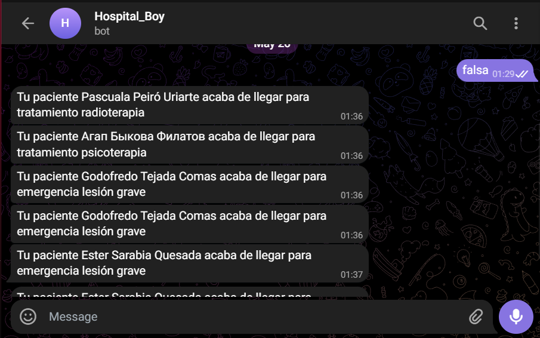

# Ampliacions

Una vegada hem assolit els objectius demanats d'aquest projecte, ens hem disposat a afegir altres utilitats al nostre programa que no es demanàven en un primer moment.

## Ampliació 1: Historial del pacient

La primera part és poder veure d'una manera senzilla totes les visites, diagnòstics, intervencions i el pla de medicació que està seguint un pacient.

Per fer això hem utilitzat diverses funcions de Python i l'hem adjuntat en una sola funció per que faci tot el necessari que es demana i transformar la informació en un expedient mèdic.

 

## Ampliació 2: Telegram per notificacions

La segona ampliació és que quan un pacient arribi a l'Hospital per la seva visita, al metge li arribi un missatge per Telegram de que ja ha arribat.

Primer hem canviat la taula de "visita" per afegir una nova columna anomenada "paciente_esperando". A aquesta columna li hem posat que és un booleà que per defecte sigui `false`, així quan el pacient arribi es pot canviar a `true`.

```sql
ALTER TABLE visita
ADD COLUMN paciente_esperando BOOLEAN DEFAULT false;
```

Després hem canviat la taula de metge per afegir l'id de telegram dins de la base de dades, d'aquesta manera cada metge té el seu id propi de telegram per detectar-lo a l'hora d'enviar el missatge.

```sql
ALTER TABLE medico
ADD token TEXT;
```

Hem creat una funció que retorna un trigger. Aquesta funció selecciona l'id de telegram del metge, el nom del pacient i el motiu de la visita i acciona un procediment.

```SQL
CREATE OR REPLACE FUNCTION send_message_function()
    RETURNS TRIGGER
    LANGUAGE PLPGSQL
AS $$
DECLARE
    chat_id TEXT;
    nombre_paciente TEXT;
    motivo_visitat TEXT;
BEGIN
    -- S'aconsegueix l'id de Telegram del metge
    SELECT token FROM medico INTO chat_id WHERE id_empleado = NEW.id_medico;

    -- S'aconsegueix el nom del pacient.
    SELECT concat(pers.nombre, ' ', pers.apellido1, ' ', pers.apellido2)
    INTO nombre_paciente
    FROM paciente pac
    INNER JOIN persona pers ON pac.dni_nie = pers.dni_nie
    WHERE pac.tarjeta_sanitaria = NEW.tarjeta_sanitaria;

    -- S'aconsegueix el motiu de la visita.
    SELECT motivo_visita 
    INTO motivo_visitat 
    FROM visita
    WHERE motivo_visita = NEW.motivo_visita;
    CALL telegram_send_message(chat_id, nombre_paciente, motivo_visitat); -- Es truca al procediment.
RETURN NEW;
END;
$$;
```

Aquesta funció l'executem amb un trigger que s'activa quan hi ha una actualització a la columna "paciente_esperando" de la taula "visita".

```sql
CREATE OR REPLACE TRIGGER send_message_trigger
    AFTER UPDATE OF paciente_esperando
    ON visita
    FOR EACH ROW
    EXECUTE FUNCTION send_message_function();
```

Al procediment li arriba com a paràmetres el chat_id del metge, el nom del pacient i el motiu de la visita. El procediment truca a un arxiu de python amb els paràmetres que hem aconseguit en la anterior funció per poder enviar el messatge per Telegram amb les variables que necessitem.

```SQL
CREATE OR REPLACE PROCEDURE public.telegram_send_message(
IN chat_id text,
IN paciente text,
IN motivo_visita text)
LANGUAGE 'plpython3u'
AS $$
    import subprocess
    subprocess.run(['python3', '/hospital/send_message.py', chat_id, paciente, motivo_visita])
END;
$$;
```

El codi de Python "send_message.py" és el que agafa el chat_id del metge, el nom del pacient i el motiu de la visita, escriu un missatge amb aquest paràmetres i ho envia amb el [bot](https://t.me/Hospita_Blanes_Bot) de Telegram segons el chat_id del metge que tingui la visita.

```PYTHON
import requests
import sys
# Enviar notificación a través de Telegram
TOKEN = "7064461168:AAF5Ny3C42UQQouGtmqMb_6dudaHsLiyfZE"
CHAT_ID = sys.argv[1]
nombre_paciente = sys.argv[2]
motivo_visita = sys.argv[3]
URL = f"https://api.telegram.org/bot{TOKEN}/sendMessage"
TEXT = f"Tu paciente {nombre_paciente} acaba de llegar para {motivo_visita}"

data = {
    "chat_id": CHAT_ID,
    "text": TEXT,
    "disable_web_page_preview": "1"
}
requests.post(URL, data=data)
```

Hem fet la prova posant un dels nostres chat_id de Telegram a un metge i aqui mostrem que funciona:

