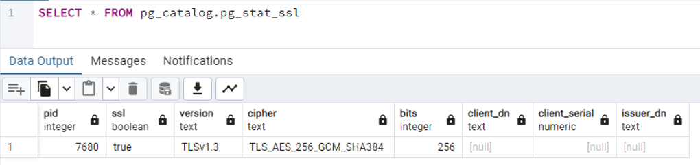
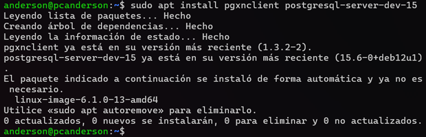
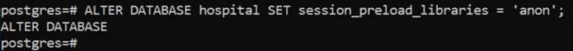
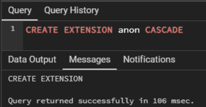

# Documentació del bloc de Seguretat

## MATRIU DE SEGURETAT

Al moment de pensar com escollir quins eren els rols a l'hora de configurar la seguretat vam optar per començar fent la matriu on plasmar totes les decisions que hem pres per això:
[Matriu de Seguretat](https://docs.google.com/spreadsheets/d/1oVSgor6DdORBpz2zxeghznz6cOOHq3w9ui5lxiUBpAU/edit?usp=sharing)
L'hem fet amb dues pàgines: La primera pàgina del document de Google Sheets és la matriu de Seguretat amb els rols, què poden fer i com és la sentència SQL per crear-los, i la segona pàgina és les vistes que hem creat i que en aquest apartat explicarem perquè hem decidit fer això.

### Vistes

Primer explicarem les vistes i perquè les fem d'aquesta manera. En tots els casos, utilitzem les vistes per poder fer un "control" de què poden veure i què no. D'aquesta manera les dades de caràcter personal que no són necessàries a l'hora de registrar visites, diagnosticar o fer una recepta no es poden veure per part de cap dels empleats. 

- **Vista de la visita**: Hem creat una vista que ens permet veure la visita amb el metge, tant el nom complet del pacient, la data, l'hora, el motiu de la visita i el nom del metge. 
- **Vista de diagnòstic**: De la mateixa manera que la vista de la visita, a l'hora de seleccionar la vista del diagnòstic veiem el nom complet del pacient, la descripció del diagnòstic i el nom de la patologia que té. A més afegim el nom complet del pacient perquè sigui més senzill d'entendre a l'hora d'accedir a aquestes dades.
- **Vista de la recepta**: A la recepta només tenen accés els metges, els infermers (per poder posar medicació a la gent que està hospitalitzada) i els farmacèutics (per poder saber quines medicines han de donar). A la vista de la recepta hem afegit el nom complet del pacient, la data i l'hora de la recepta, la dosi que s'ha de prendre i el nom complet del metge, per saber qui l'ha receptat.
- **Vista de la reserva de l'habitació**: A l'hora de mostrar les reserves de les habitacions, només es pot veure el nom complet del pacient, el número de l'habitació (amb la planta), la data d'entrada i sortida d'aquest pacient.
- **Vista de la reserva del quiròfan**: Exactament el mateix que amb la reserva de l'habitació però amb el quiròfan (en aquest cas no hi ha data de sortida, sinó una hora i una data de la realització de la intervenció).
- **Vista de la agenda**: A l'hora de gestionar l'agenda dels metges per veure quines hores hi ha lliures per a una consulta, aquesta vista ens permet accedir a l'agenda on hi ha totes les hores disponibles. Com no hi ha necessitat de canviar cap dada d'aquesta taula i a més, es necessari poder veure el nom del metge, hem creat una vista per afegir-ho.
- **Vista de la prova**: Per últim, la vista de la prova a la qual tindrà accés el metge i el científic hem afegit el nom complet del pacient i el tipus de prova a fer.

### Rols

Hem decidit crear set rols: metge, administratiu, científic, infermer, farmacèutic, recursos humans i informàtic.
- Al rol de **Metge** l'hem donat accés a les següents coses: 
    - Seleccionar la vista de la visita i insertar a la taula de visita. D'aquesta manera pot veure quin pacient té, l'hora i el motiu d'aquesta visita. També pot afegir noves dades a la taula.
    - Seleccionar la vista del diagnòstic i afegir a la taula de diagnòstic. És el metge el que ha de fer aquesta operació.
    - Seleccionar la vista de la recepta i afegir a la taula de recepta. El metge pot mirar receptes anteriors dels seus pacients i crear receptes noves.
    - Seleccionar les vistes tant de reserva d'habitació com de reserva de quiròfan. Hem decidit que el metge no pot afegir reserves d'aquest tipus sinó que és l'administratiu la persona que s'encarrega de crear les reserves. El metge té accés a elles, pot veure quines reserves hi ha però és l'administratiu (que explicarem més endavant) qui pot afegir reserves.
    - Seleccionar la vista de la prova i afegir dades. Hem conclòs que el metge és la persona que ha d'afegir les proves que s'han de realitzar als pacients, encara que siguin els científics qui les portin a terme.
    - Seleccionar els medicaments i les patologies. En aquest cas, hem pensat que com tenim dues taules amb els medicaments disponibles i totes les patologies, els metges tenen accés a aquestes taules i poden veure tot el que hi ha dins.
- Al rol d'**Administratiu** l'hem donat accés a les següents coses:
    - Selecció de les vistes de visita, reserva quiròfan, reserva d'habitació i de l'agenda perquè pugui veure totes les reserves dels pacients a l'hora de comunicar-ho.
    - Inserció a la visita, a la reserva de quiròfan i a la reserva d'habitació perquè pugui fer les insercions de les reserves, ja que l'administratiu és qui s'encarrega d'això.
- Al rol de **Científic** l'hem donat accés a les següents coses: 
    - Selecció de la vista de la prova i del diagnòstic. D'aquesta manera pot saber quina prova ha de realitzar i perquè.
    - Seleccionar i insertar a la taula de l'inventari del laboratori, ja que és aquest rol el que necessita veure que hi ha d'inventari i si s'ha de demanar més productes en cas de que falti alguna cosa.
- Al rol d'**Infermer** l'hem donat accés a les següents coses:
    - Seleccionar la vista de les receptes per poder veure les medicines que ha de posar als pacients que estan ingresats.
    - Seleccionar i insertar al material general per veure quines coses hi ha i per si s'ha d'afegir material nou.
    - Seleccionar i insertar dins del traitge perquè els infermers són els que fan aquesta tasca normalment.
    - Seleccionar i insertar dins de l'inventari del material general perquè els infermers són els que fan l'inventari del material general que utilitzen els metges i els infermers.
- Al rol de **Farmacèutic** l'hem donat accés a les següents coses: 
    - Seleccionar la vista de les receptes, ja que són ells qui proporcionen els medicaments als infermers, als metges o als pacients dins de l'hospital. També són ells qui proporcionen les medicines necessàries als quiròfans.
    - Seleccionar i insertar tant als medicaments com a l'inventari. Tant per si hi ha nous medicaments que cal afegir perquè s'aprovin dins de la Unió Europea (o a Espanya) com per demanar nous medicaments per si no hi ha suficients a l'inventari.
- Al rol de **Recursos Humans** l'hem donat accés a les següents coses:
    - Que pugui insertar i seleccionar totes les dades dels empleats ja que són ells qui s'ocupen de contractar a tots els empleats, d'assignar-li un salari i de donar-li d'alta a la Seguretat Social.
- Per últim, al rol d'**Informàtic** l'hem donat el permís especial de tenir accés a tot, ja que és ell qui pot canviar les coses i administrar la base de dades a l'hora d'arreglar alguna cosa, canviar-la, afegir coses noves, etc.

Com es pot veure, els diferents rols que tenen accés a la Base de Dades s'han escollit segons el paper que representa dins de l'hospital cadascun dels empleats.

## SSL
El primer pas és crear un certificat SSL/TLS. Per fer-ho, utilitzarem OpenSSL, una eina que ens ajudarà a aconseguir-ho.

Aquesta comanda generarà una nova sol·licitud de signatura de certificat (CSR).
```
sudo openssl req -new -text -out server.req
```

ara farem una operació RSA amb la següent ordre, que agafarà la clau privada RSA de l'arxiu ```privkey.pem``` i guardarà la clau en un ```arxiu.key```
```
sudo openssl rsa -in privkey.pem -out server.key
```

Aquesta comanda genera un certificat autofirmat en el qual agafarà la sol·licitud de certificat ```server.req```, la clau privada del certificat ```server.key``` i generarà un fitxer anomenat ```server.crt```, creant així un certificat X.509 autofirmat.
```
sudo openssl req -x509 -in server.req -text -key server.key -out server.crt
```

Ara modificarem els fitxers ```server.key``` i ```server.crt``` perquè només el propietari tingui permisos de lectura i escriptura.
```
sudo chmod og-rwx server.key server.crt
```

Traslladem els fitxers a la ruta de destinació i canviem el propietari i el grup a 'postgres' de tots els fitxers ```server.key``` i ```server.crt```.
```
mv server.crt server.key /var/lib/postgresql/15/main/
chown -R postgres:postgres server.*
```

Per configurar correctament PostgreSQL, necessitaràs accedir a l'arxiu de configuració 'postgres.conf' amb el teu editor de text preferit. Hauràs de prestar atenció a tres línies específiques:

- ```ssl = on```, permet l'ús de SSL (Secure Sockets Layer), tot i que per norma general aquesta opció està activada de forma predeterminada.
- ```ssl_cert_file```, hauràs d'especificar la ruta del teu arxiu .crt que conté el certificat SSL.
- ```ssl_key_file```, hauràs de proporcionar la ruta del teu arxiu .key que conté la clau privada SSL.

```
# - SSL -

ssl = on
#ssl_ca_file = ''
ssl_cert_file = '/var/lib/postgresql/15/main/server.crt'
#ssl_crl_file = ''
#ssl_crl_dir = ''
ssl_key_file = '/var/lib/postgresql/15/main/server.key'
#ssl_ciphers = 'HIGH:MEDIUM:+3DES:!aNULL' # allowed SSL ciphers
#ssl_prefer_server_ciphers = on
#ssl_ecdh_curve = 'prime256v1'
#ssl_min_protocol_version = 'TLSv1.2'
#ssl_max_protocol_version = ''
#ssl_dh_params_file = ''
#ssl_passphrase_command = ''
#ssl_passphrase_command_supports_reload = off
```

Amb aquesta configuració només es permet que les connexions locals puguin accedir a la base de dades sense cap informació addicional. Totes les connexions IPv4 hauran de autenticar-se utilitzant MD5 a través de SSL, el que ens proporciona una capa addicional de seguretat.
```
# Database administrative login by Unix domain socket
local   all             postgres                                peer

# TYPE  DATABASE        USER            ADDRESS                 METHOD

# "local" is for Unix domain socket connections only
local   all             all                                     peer
# IPv4 local connections:
#host    all             all             127.0.0.1/32            scram-sha-256
hostssl    all             all             0.0.0.0/0               md5
# IPv6 local connections:
#host    all             all             ::1/128                 scram-sha-256
# Allow replication connections from localhost, by a user with the
# replication privilege.
local   replication     all                                     peer
host    replication     all             127.0.0.1/32            scram-sha-256
host    replication     all             ::1/128                 scram-sha-256
```

Aquí la comprovació de que estem connectats utilitzant SSL.


## DATAMASKING

Aprofitant que l'Isaac tenia el repte de Datamasking seguim els passos per a instal·lar-lo i activar-lo.

Primer de tot despleguem l'extensió en el servidor amb les següents comandes
```
sudo apt install pgxnclient postgresql-server-dev-15
sudo pgxn install postgresql_anonymizer
```
Aquí les comprovacions




Una vegada fet carreguem l'extensió en la nostra base de dades:
```
ALTER DATABASE hospital SET session_preload_libraries = 'anon';
```



Després dins de la nostra base de dades creem l'extensió:
```
CREATE EXTENSION anon CASCADE;
```


Ara ja executarem el nostre sql en el qual iniciem el servei, determinem els rols que tindran seguretat i creem la seguretat

Hem decidit censurar aquestes dades ja que són dades d'alta privacitat, la salut és una de les dades que més s'han de protegir i és per això que hem censurat els diagnóstics i les visites en comptes de censurar els DNI o els telèfons de les persones ja que són dades de caràcter personal.

[LINK SQL](https://github.com/Xadouuu7/hospital/blob/main/postgres/Esquema_Seguridad/Anon.sql)


## AEPD
[Documentació AEPD](https://github.com/Xadouuu7/hospital/blob/main/postgres/Esquema_Seguridad/AEPD.pdf)