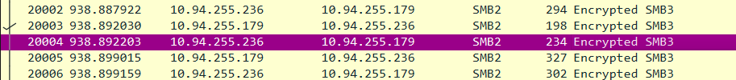
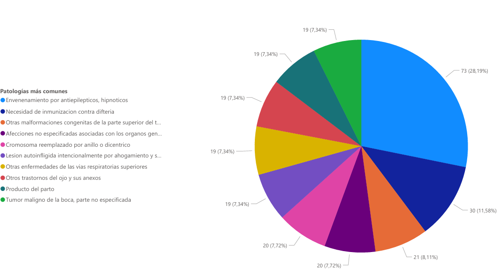
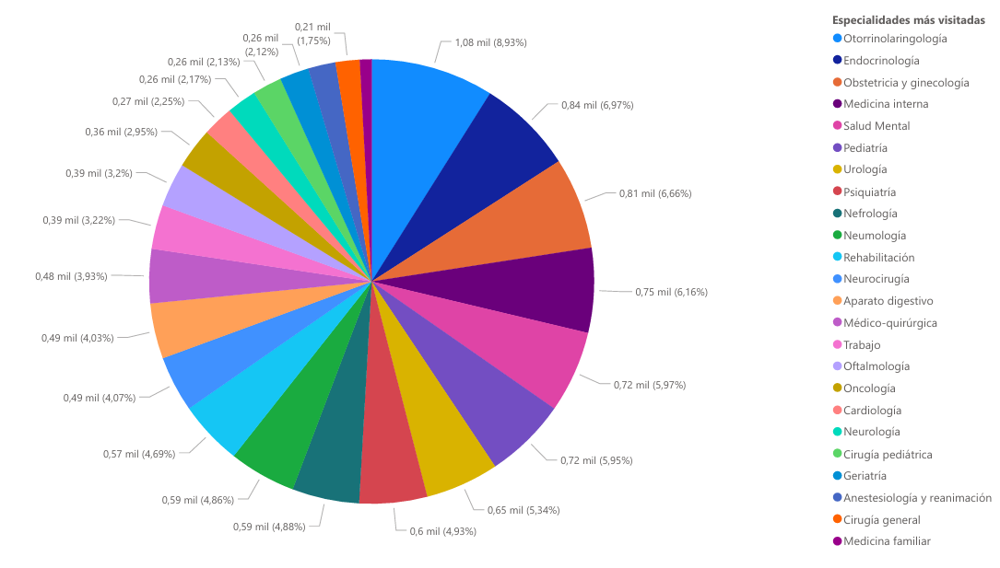

# Bloc d'Exportació i PowerBI

S'ens demana que es pugui exportar diferents dades des del menú de l'aplicació. Nosaltres l'implementem al menú dels empleats de Recursos Humans perquè puguin descarregar-se l'XML que ells/es escullen i així poder utilitzar l'XML per generar diferents gràfics i taules d'informació rellevant amb la eina de PowerBI. Primer explicarem el codi d'exportació i després ensenyarem els XMLs dins de PowerBI amb diferents gràfics.

[Enllaç al codi d'exportació](python/Bloque%20Conexión%20Login/funciones.py)

## Bloc d'Exportació

La part de Bloc d'Exportació és la part del codi de Python que exporta les dades de la Base de dades com a fitxer XML.

Dins del menú de Recursos Humans tenim una opció anomenada "Exportar a XML"

```python
def menuRecursosHumanos(usuario, conn, cursor):
    bucle = True
    while bucle:
        try:
            os.system('clear')
            print('-' * 40)
            print('Menú gestión recursos humanos')
            print('-' * 40, end='\n\n\n')
            print("1. Dar alta empleado")
            print("2. Consultar recursos hospitalarios")
            print("3. Informe personal")
            print("4. Informe visitas")
            print("5. Ranking médicos")
            print("6. Patologias más comunes")
            print("7. Exportar a XML")
[...]
            elif respuesta == '7':
                titulo('Exportar XML')
                print('1. Exportar XML de las visitas entre dos fechas')
                print('2. Exportar XML de las patologias mas comunes')
                respuesta = input("Escoger una opcion: ")
                if respuesta == '1':
                    exportXML_visitas(usuario, conn, cursor)
                elif respuesta == '2':
                    exportXML_patologies(usuario, conn, cursor)
```

Aquest bloc de codi ens permet escollir entre dues opcions d'exportació. La primera és l'exportació de l'informe de les visites entre dues dates:

```python
def exportXML_visitas(usuario, conn, cursor):
    titulo('Exportacion de visitas')
    fecha_inicial = input('Introduce la fecha inicial(YYYY-MM-DD):')
    fecha_final = input('Introduce la fecha final(YYYY-MM-DD):')
    consulta = """
    WITH xml_output AS (
        SELECT query_to_xml('SELECT * FROM view_visita2 WHERE TO_CHAR(fecha_hora, ''YYYY-MM-DD'') BETWEEN '%s' AND '%s'', true, false, '') AS xml_result
    )
    SELECT REPLACE(xml_result::text, '<table xmlns:xsi="http://www.w3.org/2001/XMLSchema-instance">', '<table xmlns:xsi="http://www.w3.org/2001/XMLSchema-instance" xsi:noNamespaceSchemaLocation="visitas.xsd">
    ') AS modified_xml_result
    FROM xml_output;
"""
    
    cursor.execute(consulta, (fecha_inicial, fecha_final))
    xml_result = cursor.fetchone()[0]

    nombre_archivo = '/home/program_user/XML/visitas.xml'
    with open(nombre_archivo, 'w',encoding='UTF-8') as archivo:
        archivo.write(xml_result)
    print(f"Los datos han sido exportados correctamente a {nombre_archivo}.")
    input('Enter para continuar')
```

Aquest codi és la funció que utilitzem per exportar les dades de les visites en XML. Passem per paràmetre l'usuari, la connexió a la base de dades i el cursor. Genera un menú on pots entrar manualment dues dates que són les que es pasaran dins de la sentència SQL que utilitzem per generar l'XML. Existeix un `SELECT` de PostgreSQL que et genera un XML a partir d'una selecció de dades, per tant, és el que hem emprat en aquest codi. Aquesta sentència genera un XML amb les dades de la vista `view_visita2` entre les dues dates que hem introduït.

```sql
SELECT query_to_xml('SELECT * FROM view_visita2 WHERE TO_CHAR(fecha_hora, ''YYYY-MM-DD'') BETWEEN '%s' AND '%s'', true, false, '') AS xml_result
```

I després, la següent sentència SQL que enviem al PostgreSQL des de Python és la que modifica l'XML generat perquè es pugui llegir amb l'XSD que hem creat prèviament:

```sql
SELECT REPLACE(xml_result::text, '<table xmlns:xsi="http://www.w3.org/2001/XMLSchema-instance">', '<table xmlns:xsi="http://www.w3.org/2001/XMLSchema-instance" xsi:noNamespaceSchemaLocation="visitas.xsd">
    ') AS modified_xml_result
    FROM xml_output;
```

I després, la darrera part de la funció és la que serveix per crear l'arxiu dins del servidor i escriure l'XML:

```python
 nombre_archivo = '/home/program_user/XML/visitas.xml'
    with open(nombre_archivo, 'w',encoding='UTF-8') as archivo:
        archivo.write(xml_result)
```

I finalment, ens mostra per pantalla que s'ha exportat correctament i que pots continuar amb el programa.

Després tenim la part d'exportació de les malalties més comuns. Funciona de la misma manera que la primera funció però exporta un XML de la vista de les malalties més comuns que hi ha dins de la base de dades:

```python
def exportXML_patologies(usuario, conn, cursor):
    titulo('Exportacion de patologias')
    consulta = """
    WITH xml_output AS (
        SELECT query_to_xml('SELECT * FROM view_malalties_comuns', true, false, '') AS xml_result
    )
    SELECT REPLACE(xml_result::text, '<table xmlns:xsi="http://www.w3.org/2001/XMLSchema-instance">', '<table xmlns:xsi="http://www.w3.org/2001/XMLSchema-instance" xsi:noNamespaceSchemaLocation="patologies.xsd">
    ') AS modified_xml_result
    FROM xml_output;
"""
    
    cursor.execute(consulta)
    xml_result = cursor.fetchone()[0]

    nombre_archivo = '/home/program_user/XML/patologies.xml'
    with open(nombre_archivo, 'w',encoding='UTF-8') as archivo:
        archivo.write(xml_result)
    print(f"Los datos han sido exportados correctamente a {nombre_archivo}.")
    input('Enter para continuar')
```

## PowerBI

PowerBI és un servei d'anàlisi de dades de Microsoft orientat a proporcionar visualitzacions interactives i capacitats d'intel·ligència empresarial amb una interfaç simple perquè els usuaris finals puguin crear els seus propis informes i panells. Ofereix capacitats d'emmagatzematge de dades, preparació de dades, descobriment de dades i panells interactius.

Nosaltres hem optat per utilitzar els XMLs que es generen des de l'aplicació i utilitzar-los per generar diferents gràfics que són útils per l'hospital. 

Hem fet que la carpeta on es generan els diferents XMLs sigui accessible a qualsevol usuari que estigui dins de la mateixa xarxa, d'aquesta manera les dades dels gràfics sempre estan actualitzats.

Utilitzem el [samba](https://www.samba.org) que és un programa que ens permet compartir carpetes en la xarxa. 
Configurant el samba ens permet encriptar la connexió perque no estigui en text pla. Només em permés que l'únic usuari vàlid sigui `program_user`:

```bash
[xml]
path = /home/program_user/XML
public = no
browseable = yes
guest ok = no
smb encrypt = required
valid users = program_user
```

Hem utilitzat el WireShark per comprovar que efectivament les dades estan encriptades a la xarxa:



Els usuaris que utilitzin el PowerBI hauràn de escriure la ruta de la carpeta compartida en la xarxa.

Amb el PowerBI hem generat dos informes: Patologies més comuns i especialitats més visitades.

### Patologies més comuns



### Especialitats més visitades



Es pot veure el PDF generat a partir de PowerBI aquí:

[Informe en PDF](postgres/PowerBI/Informes.pdf)
